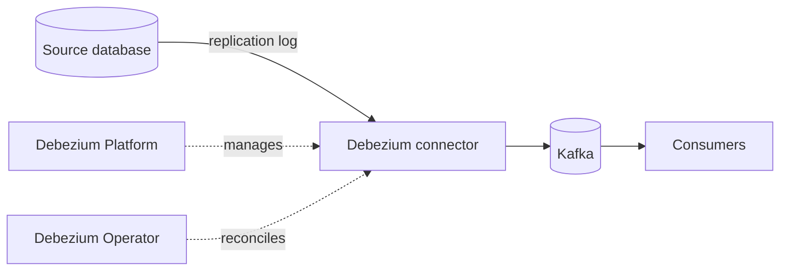

# Architecture

What gets deployed, and the path a row change takes to become an event a consumer can read.

!!! warning "Placeholder"

    This page is a skeleton.

Topics to cover: the role of each component, which are operators and which are workloads,
what the platform's own datastore holds, and where the boundary sits between this
automation and the platform itself.
