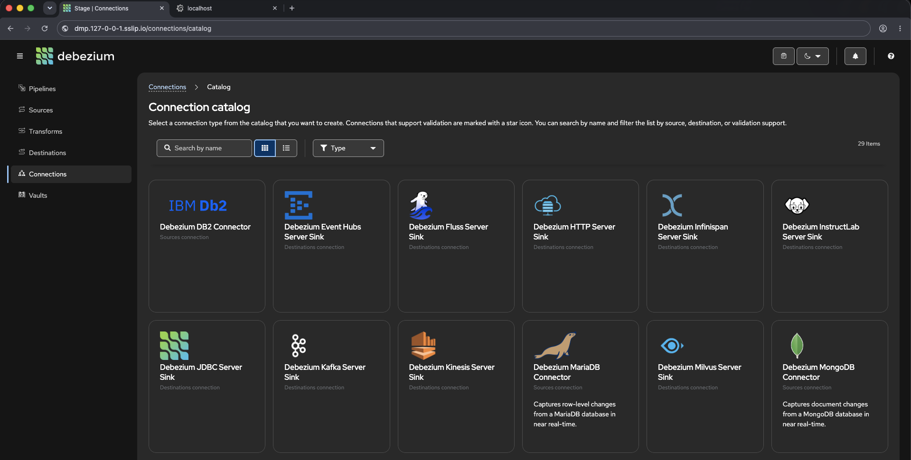

# Deploy the stack

Two commands: create the cluster, apply the releases. Ordering, waiting, and dependency
resolution are handled by the `helmfile` command.

```shell
git clone https://github.com/pxcamus/debezium-platform-lab.git
cd debezium-platform-lab

cp .env.example .env
just kind-recreate
just apply
```



When `just apply` finishes, open <http://dmp.127-0-0-1.sslip.io/> in a browser. That is the stage
UI — the screenshot above is its connection catalog, listing every source and destination the
platform can create.

Everything after the clone runs from the repository root — `.env`, the cluster config and the
helmfile are all resolved relative to it.

## Configure

`.env` is the only file you edit. Copy the template and change nothing for a local run:

```shell
cp .env.example .env
```

The defaults matter in one place. `DPL_DOMAIN` is `127-0-0-1.sslip.io`, a public DNS name
that resolves to `127.0.0.1` — which is where Kind publishes ports 80 and 443. That is what
makes `dmp.127-0-0-1.sslip.io` reach your cluster with no `/etc/hosts` editing.

### How the two files layer

All configuration is environment variables, read from two files by
[`scripts/lib/env.sh`](https://github.com/pxcamus/debezium-platform-lab/blob/main/scripts/lib/env.sh):

1. [`deploy/environment/versions.env`](https://github.com/pxcamus/debezium-platform-lab/blob/main/deploy/environment/versions.env)
   — shared, non-sensitive version pins, committed.
2. `.env` — your secrets and host-specific overrides, git-ignored.

Both are sourced in that order, so **`.env` wins**. Every `just` recipe loads them, as does
`scripts/with-env.sh` for one-off commands and `scripts/validate-helm.sh` for offline checks.

Two consequences worth knowing:

- **Version pins live in `versions.env` only.** `.env` never duplicates them, which is why a
  CI checkout with no `.env` at all still renders.
- **`.env` overrides your shell.** Because the loader sources with `set -a`, an exported
  variable does *not* take precedence — `DPL_ENV=homelab just hf template` silently renders
  `local` if `.env` says `local`. Edit `.env` to change environments.

`.env.example` is deliberately minimal: only variables with no default anywhere, or whose
default is wrong when you run from your own machine.

??? info "Every variable"

    | Variable | Purpose | Default |
    |---|---|---|
    | `DPL_ENV` | Deployment environment; selects `deploy/values/<component>/<DPL_ENV>.yaml.gotmpl` | `local` |
    | `DPL_DOMAIN` | Base DNS zone; every ingress host is `<component>.${DPL_DOMAIN}` | **required** — rendered with `requiredEnv`, so helmfile fails outright if unset |
    | `DPL_DEBEZIUM_VERSION` | Debezium Helm chart version | **required**, from `versions.env` |
    | `DPL_NAMESPACE` | Debezium Platform namespace | `dmp` |
    | `DPL_OPERATOR_MODE` | `bundled` (operator as a platform subchart) or `standalone` (its own release, image pinned independently) | `bundled` |
    | `DPL_CLUSTER_TYPE` | Cluster provider: `kind` or `k3s` | `kind` |
    | `DPL_DMP_RESOURCE_PREFIX` / `DPL_DMP_ENVIRONMENT` | Prefix for deterministic DMP resource names | — |
    | `DPL_DMP_KAFKA_BOOTSTRAP_SERVERS` | Kafka bootstrap for DMP payloads | — |

    Known `DPL_ENV` values: `local`, `homelab` (self-hosted k3s + public TLS), `aws`,
    `hetzner`. Each has a matching values file under `deploy/values/<component>/`.

    `k3s` support for `DPL_CLUSTER_TYPE` is not migrated yet — `just cluster-recreate`
    reports this rather than doing something surprising.

    DMP JSON payloads use `${ENV_VAR}` syntax, expanded from the environment when the
    payload is loaded.

## Create the cluster

```shell
just kind-recreate
```

Deletes any existing `dmp` cluster, creates a fresh one from
`deploy/clusters/kind/kind-ingress.yaml`, and points `kubectl` at it. The cluster config maps
host ports 80 and 443 into the node, so the ingress controller is reachable from your browser.

Destructive by design — it is the fastest way back to a known state when an experiment goes
sideways.

## See what will be installed

```shell
just releases
```

```
debezium-platform
ingress-nginx
kube-prometheus-stack
opentelemetry-operator
```

That is the whole default installation: the platform, an ingress controller, and monitoring.
Databases, Kafka, and the other optional components are switched off until you ask for them.

This reads the helmfile, not the cluster — it answers "what would I get", so you can run it
before creating a cluster at all.

## Apply the releases

```shell
just apply
```

Every enabled release, in dependency order, waiting for each to become ready before starting
what depends on it. Safe to re-run: releases already at the desired state are left alone.

Expect the first run to take several minutes on a cold image cache — `kube-prometheus-stack`
alone is a large chart with very large CRDs.

To apply a subset, pass any helmfile selector through:

```shell
just apply --selector app=debezium-platform
just apply --selector infra=true
```

## Verify

```shell
kubectl get pods -A
```

Every pod in `dmp`, `monitoring` and `ingress-nginx` should reach `Running`. Then the stage
UI at **`http://dmp.127-0-0-1.sslip.io`** and Grafana at **`http://grafana.127-0-0-1.sslip.io`**
(user `admin`, password `grafanapassword` — the cluster is disposable and reachable only over
loopback).

## Other commands

`just hf` passes anything through to helmfile against this repository's state file:

```shell
just hf template
just hf diff
just hf --selector app=debezium-operator destroy
```

Releases carry `app=<release-name>` labels, plus `infra=true` on the ingress controller and
the monitoring stack. See
[`deploy/helmfile.yaml.gotmpl`](https://github.com/pxcamus/debezium-platform-lab/blob/main/deploy/helmfile.yaml.gotmpl).

Optional components are enabled with state values rather than selectors, because a selector
cannot switch on something the helmfile has gated off:

```shell
just apply --state-values-set components.sqlserver=true
```

## Validate without a cluster

```shell
scripts/validate-helm.sh
```

Lints the charts, asserts that the default installation is exactly the four releases above, and
renders every environment through `kubeconform`. CI runs the same script on changes under
`deploy/` ([`helm-validation.yaml`](https://github.com/pxcamus/debezium-platform-lab/blob/main/.github/workflows/helm-validation.yaml)).

## Tear down

```shell
kind delete cluster --name dmp
```

Next: [run your first pipeline](first-pipeline.md). If something failed, see
[Troubleshooting](../troubleshooting/index.md).
